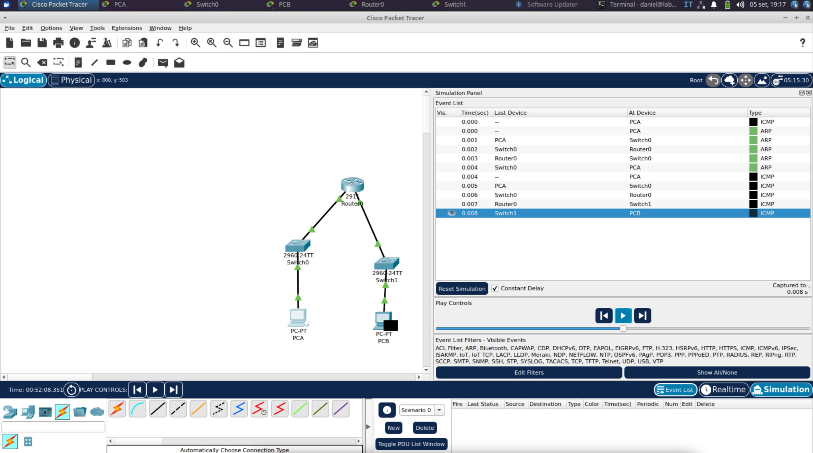

# ShadowCore Lab 01 — Routing, ARP and Default Gateway

Hands-on Packet Tracer lab created while studying for the CompTIA Network+ N10-009 certification.

## Objectives

- Configure IPv4 addressing on two different subnets
- Configure router interfaces
- Verify default gateway connectivity
- Test inter-subnet communication
- Observe ARP and ICMP traffic
- Understand Layer 2 vs Layer 3 forwarding

## Topology

PC-A — Switch0 — Router0 — Switch1 — PC-B

## IP Addressing

- PC-A: 192.168.10.10/24
- Default Gateway: 192.168.10.1
- Router G0/0: 192.168.10.1/24
- Router G0/1: 192.168.20.1/24
- PC-B: 192.168.20.10/24
- Default Gateway: 192.168.20.1

## Verification

- PC-A → Default Gateway: Successful
- PC-B → Default Gateway: Successful
- PC-A ↔ PC-B: Successful

## Protocols Observed

- ARP
- ICMP

## Troubleshooting

During configuration, Router G0/1 was found in an `administratively down` state.

The issue was identified using:

`show ip interface brief`

and corrected with:

`no shutdown`

## Key Learning

When a host sends traffic to a remote subnet, the destination IP remains the final remote host, while the Ethernet destination MAC address points to the next hop.

MAC addresses change hop-by-hop, while IP addresses remain end-to-end when NAT is not involved.
## Lab Evidence

The following screenshot shows ARP resolution and ICMP communication in Packet Tracer Simulation Mode.

## Lab Evidence

The following screenshot shows ARP resolution and ICMP communication in Packet Tracer Simulation Mode.

